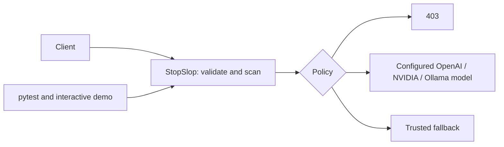

# Scope and expectations

Sources: `RULES AI Control Layer.pdf` and `CRIETRIA AI Control Layer.pdf` in this directory.

Implemented: deterministic and semantic input/output checks, centralized policy files,
block/filter/local/warning actions, approved model lists, optional authenticated-client
suspension, persistent shared token quotas, historical attack signatures, optional
incident-to-policy generation, live policy reload, a terminal dashboard, exportable
audit metadata, automated positive/negative tests, and an interactive provider-independent demo.
See [governance](governance.md) for configuration and operating limits.

AgentGuard and an authenticated authorization endpoint now provide explicit tool/MCP
and memory operation permissions. The TUI supports scrollable violation and recorded
chat history; runtime state is consolidated in one SQLite repository.

Still outside the demonstrated scope: operating system quarantine, repository
scanning, distributed quota storage, financial pricing,
and measured real-classifier accuracy. Tests mock upstreams/classifiers; no claim of
comprehensive exploit detection or production readiness follows from passing tests.

Criteria weights: robustness 30%, architecture 20%, reporting 20%, testing 15%,
scalability 15%. Rules instead assign testing 20% and scalability 10%; retain this
discrepancy for organizer clarification. Submission requires project/team details and
at most ten PDF slides; rules state Oct 3 23:00 to Oct 4 23:00 as the competition window.

Review checkpoints: (1) workspace/config and policy semantics, (2) input/output and
offline forwarding checks, (3) shared quota and client-suspension regressions, (4)
adaptive-feed validation, positive/negative exploit cases, and documented gaps.
Do not commit `.env`, credentials, incident feeds, or runtime control state.

Architecture now separates the provider gateway (`stopslop-proxy`) from the shared policy
engine (`stopslop`), demo and dashboard. One runtime setting vocabulary covers environment,
flags and Python; policies contain enforcement decisions only. See [demo checklist](demo.md)
for evidence to collect against each criterion before submission.
