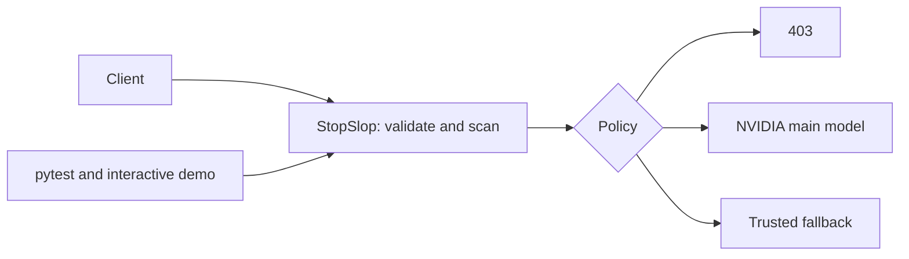

# Scope and expectations

Sources: `RULES AI Control Layer.pdf` and `CRIETRIA AI Control Layer.pdf` in this directory.

Implemented: deterministic input controls, centralized environment/rule configuration,
block/redact/redirect/passthrough choices, safe audit metadata, positive/negative
synthetic tests, offline upstream assertions and interactive NVIDIA demonstration.

Deferred: semantic NDA detection, budgets, historical-exploit controls, response
filtering, dashboard, live configuration reload, authentication and production hardening.
This initial version does not satisfy the full challenge's hybrid-defense requirements.

Criteria weights: robustness 30%, architecture 20%, reporting 20%, testing 15%,
scalability 15%. Rules instead assign testing 20% and scalability 10%; retain this
discrepancy for organizer clarification. Submission requires project/team details and
at most ten PDF slides; rules state Oct 3 23:00 to Oct 4 23:00 as the competition window.

Review checkpoints: (1) workspace/config and policy semantics, (2) rules and offline
forwarding checks, (3) pytest results and demo verification and documented gaps. Commit after review
at each checkpoint; do not commit `.env` or credentials.
